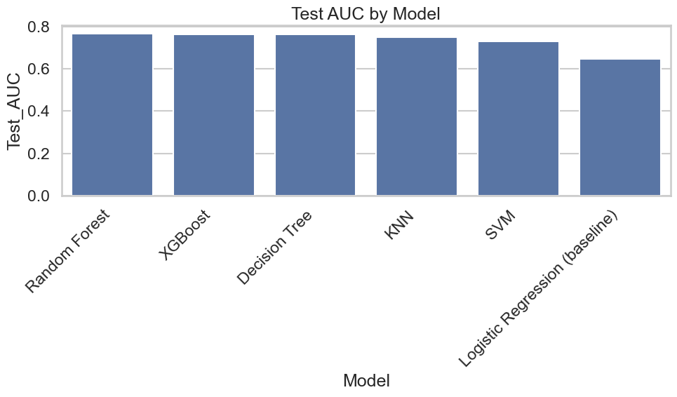
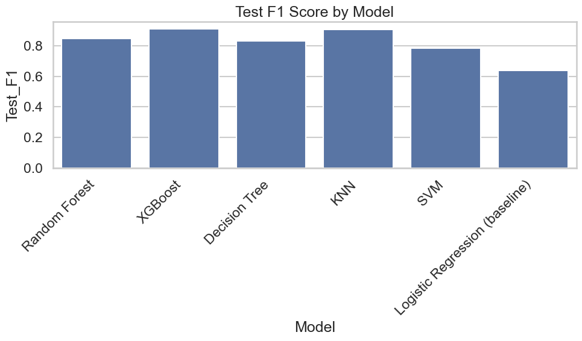
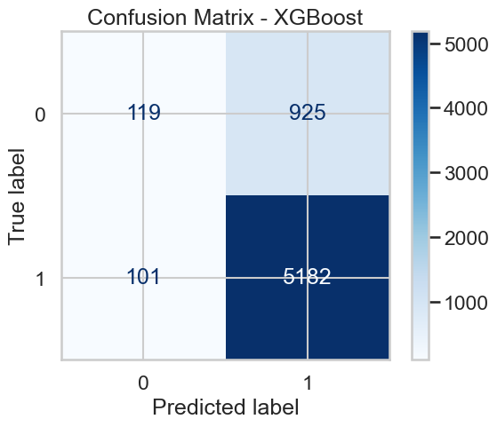
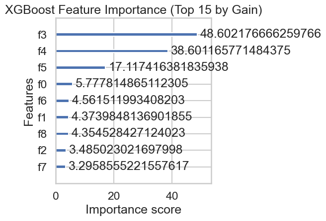
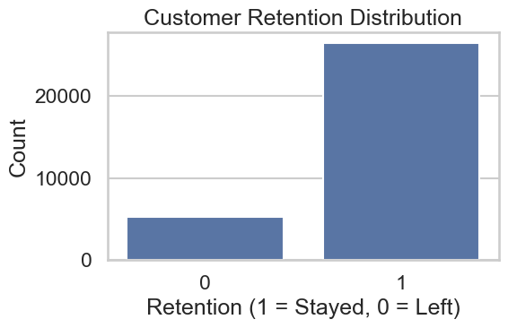

# Customer Retention Prediction using Machine Learning

## 📌 Project Overview

This project applies machine learning classification techniques to predict customer retention (churn). The goal is to identify customers at risk of leaving and support data-driven retention strategies.

---

## 📊 Dataset

* Customer-level dataset including:

  * Demographics
  * Account activity
  * Usage behavior

---

## ⚙️ Methodology

### Data Processing

* Missing value handling
* Encoding categorical variables
* Feature scaling
* Train-test split

---

### Models Implemented

* Logistic Regression
* K-Nearest Neighbors (KNN)
* Decision Tree
* Random Forest
* XGBoost

---

## 📈 Model Performance

  

<i>Model comparison based on AUC score.</i>

  

<i>F1-score comparison highlighting balance between precision and recall.</i>

---

## 🔍 Confusion Matrix (Best Model)

  

<i>XGBoost confusion matrix showing classification performance.</i>

---

## 📈 ROC Curve

  

<i>ROC curve showing strong classification ability of XGBoost.</i>

---

## 🔑 Feature Importance

  

<i>Top features influencing customer retention predictions.</i>

---

## 📊 Data Insights

  

<i>Distribution of retained vs churned customers.</i>

---

## 🔍 Key Insights

* XGBoost achieved the best overall performance based on AUC and F1-score
* Recall is critical for identifying at-risk customers
* Ensemble models outperform simpler models in classification tasks

---

## 💡 Business Insights

* Early identification of churn enables targeted retention strategies
* Retention-focused models can significantly reduce customer loss
* Data-driven decision-making improves marketing effectiveness

---

## 📁 Project Structure

* `data/` → dataset
* `notebooks/` → analysis
* `images/` → visualizations
* `reports/` → report

---

## 🛠 Tools & Technologies

* Python
* Pandas
* Scikit-learn
* XGBoost
* Matplotlib

---

## 🚀 Future Improvements

* Hyperparameter tuning for improved model performance
* Incorporation of behavioral and transactional features
* Deployment of model for real-time churn prediction
